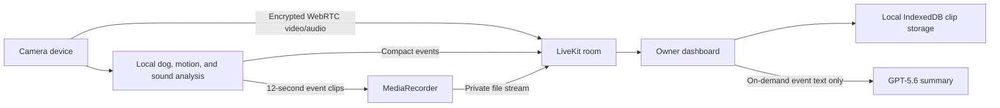

# Pawly — AI Dog Monitor

Pawly turns a spare phone, tablet, or laptop into a private, dog-aware room monitor. One device stays with the dog; another opens a live dashboard that shows meaningful activity, saves short event clips, and produces an evidence-based AI behavior summary.

**Live demo:** [pawly-sigma.vercel.app](https://pawly-sigma.vercel.app)

> Built for the OpenAI Codex Build Week. Pawly reuses hardware people already own instead of requiring another dedicated pet camera.

## What Pawly does

- Creates a private 12-character room and separate camera/viewer experiences.
- Streams live video and optional room audio between modern browsers using LiveKit and WebRTC.
- Detects dog presence locally with MediaPipe EfficientDet-Lite0.
- Uses adaptive sampling so dog detection runs faster after meaningful movement and slower while the room is settled.
- Uses whole-frame change only to wake the detector, then reports movement from the tracked dog box; moving the camera itself or an empty room does not create a dog-movement event.
- Detects sustained sound locally without continuously uploading media to an AI model.
- Builds a timestamped activity timeline and automatically saves 12-second event clips.
- Stores up to 20 clips locally in the viewer browser and transfers them through the private LiveKit room.
- Supports quick checks from 10–30 minutes and normal outings from 30 minutes to 12 hours.
- Lets the owner hear the room with an explicit playback control, speak back to the dog, remotely wake the camera display, and zoom the live view.
- Produces an optional GPT-5.6 behavior review from compact event text—not from raw video or audio.
- Keeps the camera device running behind a nearly black standby surface without requiring its screen to stay visually bright.

Pawly reports observable signals such as movement, visibility, settling, and sustained sound. It does not diagnose anxiety, health, emotion, or classify sound as barking unless a future audio classifier explicitly supports that distinction.

## How Codex was used

Codex was the development partner for the complete working product rather than a one-off code completion tool. Starting from a product conversation and real use on an iPad, Codex helped:

1. Turn the initial idea into a scoped two-device beta and technical architecture.
2. Build the React and TypeScript application, responsive landing page, setup flow, camera station, and owner dashboard.
3. Integrate LiveKit permissions, room tokens, WebRTC video/audio, data messages, file transfer, and full-duplex talkback.
4. Implement local motion analysis, MediaPipe dog detection in a Web Worker, adaptive inference intervals, sustained-sound gating, and event recording.
5. Add IndexedDB clip storage, remote display wake, camera/view zoom, long-outing controls, and conservative session summaries.
6. Diagnose real iPad and browser permission behavior, test token scopes, run TypeScript/build validation, and iteratively improve the experience from live feedback.
7. Design the AI cost boundary so continuous media stays outside the model and only a compact event timeline is summarized on demand.

The repository's commit history reflects this iterative Codex workflow, from the first room monitor through dog-aware detection, event clips, AI summaries, zoom, visual polish, and talkback.

## How GPT-5.6 is used

GPT-5.6 is a runtime feature inside Pawly's **AI behavior summary**.

When the owner requests a review, the server sends at most 100 compact, timestamped event records such as `dog_visible`, `motion_active`, `sound_active`, and `settled`. GPT-5.6 returns a strict structured response containing:

- a session headline;
- a concise observable behavior sequence;
- up to three notable patterns;
- a cautious next step grounded in the session length.

The model never receives the continuous live feed, event clips, images, or raw audio. The prompt explicitly prevents medical or emotional diagnosis, prevents calling generic sound “barking,” and prevents implying that a planned outing duration was fully observed when it was not.

AI summaries are optional, explicitly requested, token-limited, and protected by daily/monthly cost caps. If the model is disabled, capped, or unavailable, Pawly falls back to a deterministic local summary.

## Architecture



## Real-use flow

1. Open `/setup` and copy the camera link to a spare device.
2. Allow camera and, optionally, microphone access.
3. Open the private viewer link on another phone or computer.
4. Choose **Quick check** or **Going out** and the planned observation window.
5. Check the live room only when needed; Pawly records meaningful timeline changes and short event clips.
6. Select **Summarize behavior** or **Finish & review** for the GPT-5.6-assisted session review.

## Technology

- OpenAI Codex
- GPT-5.6 through the OpenAI Responses API
- React 19, TypeScript, Vinext, Vite
- LiveKit and WebRTC
- MediaPipe Tasks Vision / EfficientDet-Lite0
- Web Workers, Web Audio API, MediaRecorder API
- IndexedDB
- Vercel

## Local development

1. Copy `.env.example` to `.env.local`.
2. Add a LiveKit project URL, API key, and secret.
3. Install dependencies with `pnpm install`.
4. Start the app with `pnpm dev`.
5. Open `http://localhost:3000/setup`.

For a second device on the local network, use an HTTPS origin. Camera and microphone access are blocked on ordinary non-localhost HTTP origins.

## Environment variables

Required:

```text
NEXT_PUBLIC_LIVEKIT_URL=
LIVEKIT_API_KEY=
LIVEKIT_API_SECRET=
```

Optional AI:

```text
AI_FEATURE_ENABLED=true
OPENAI_API_KEY=
OPENAI_MODEL=gpt-5.6-luna
AI_DAILY_REQUEST_LIMIT=20
AI_MONTHLY_BUDGET_USD=5
```

The application remains useful without an OpenAI key. The UI labels whether a review came from GPT-5.6 or the deterministic fallback.

## Cost and privacy boundaries

- Continuous video/audio is never sent to OpenAI.
- Dog, motion, and sound gating run in the camera browser.
- The optional model request contains only compact event text, requests at most 300 output tokens, and is initiated by the owner.
- The beta stores no continuous cloud recording.
- Saved event clips remain in the viewer's local browser storage.
- The current in-memory AI budget counter is suitable for a private beta; a durable atomic ledger is required before horizontally scaled public use.

## Beta security boundary

The room key currently acts as an unguessable capability URL rather than a complete account system. This is appropriate for a small private beta. Public signup should add account authentication, household membership, revocable room credentials, durable encrypted event storage, and an audit log.
